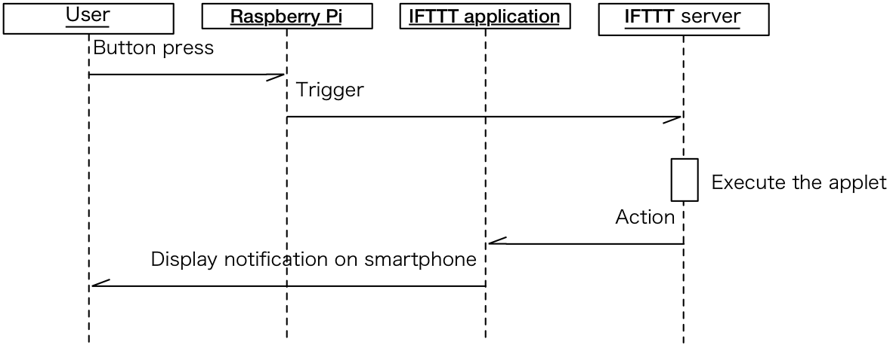
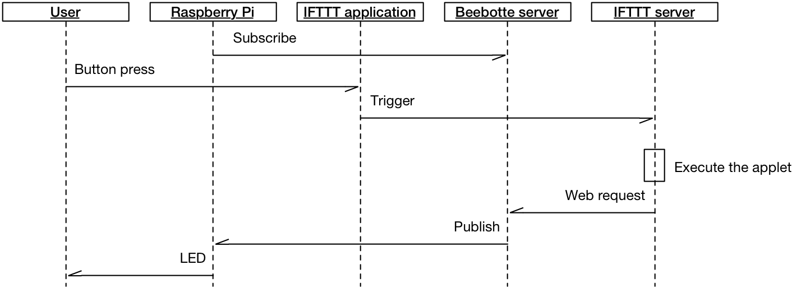
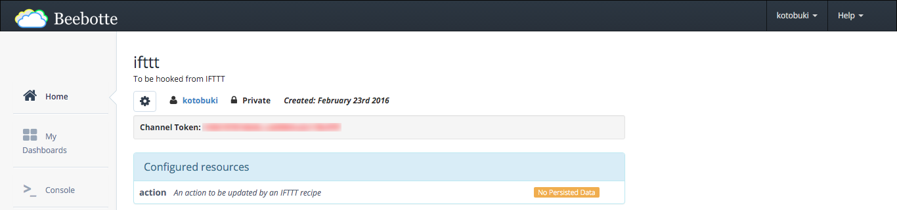
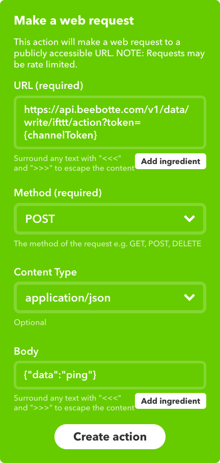
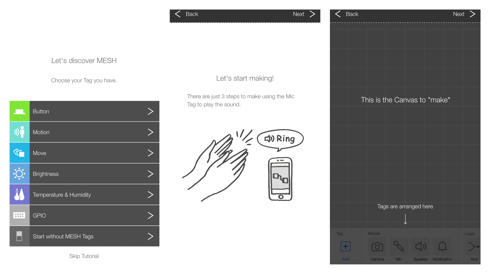
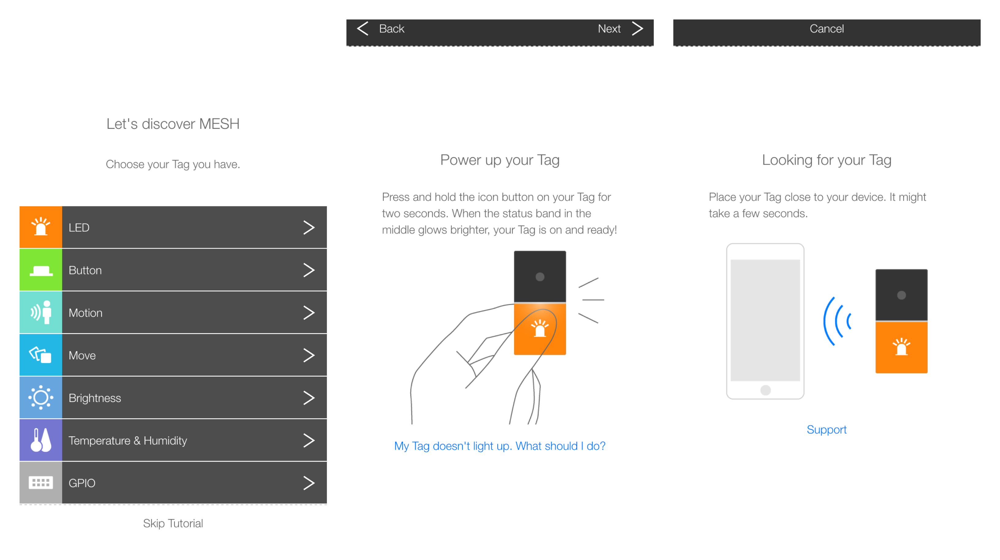
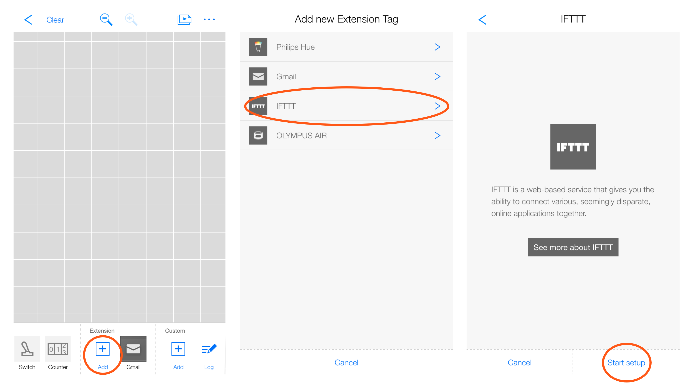

# IoT Primer: Day 2

## IFTTT

### What is IFTTT?

To connect the hardware to the network and take action on the network, it is easy to use a web service that freely combines and executes various web services as triggers or actions. A representative example of such a web service is [IFTTT](https://ifttt.com/discover) operated by IFTTT Inc. In addition to various web services including Twitter, Facebook, Instagram, IFTTT supports devices such as smart lock, network compatible remote control, communication robot and so on. In addition, it supports a mechanism for connecting homebrew devices.


### Trigger

To connect home-brew devices as a service to IFTTT, access the following URL to authenticate the Maker Webhooks service. Then the key will be issued, so copy and paste it and make a note of it.

`URL` https://ifttt.com/maker_webhooks



#### Try out

By clicking the "Documentation" button in the upper right corner of the page, you can access the page where you can actually issue a trigger and check its operation.

To trigger the Maker Webhooks service, simply access the following URL and generate a web request: At this time, the key is used to check if it is the correct request. For this reason, it is necessary not to disclose key information to outside.

`URL` https://maker.ifttt.com/trigger/{event}/with/key/{key}

Next, create an applet triggered by Maker Webhooks on [the "My Applets" tab](https://ifttt.com/my_applets) of the IFTTT web page (or smartphone application). The action can be anything but it is a good idea to use the IF Notification service as it is easier to understand at the testing stage.

Once you have created your Applet, issue a trigger from the "Documentation" page and confirm that notifications will arrive on your smartphone.

#### Issue trigger from Raspberry Pi

Run the sample at the terminal as shown below and press the button connected to the GrovePi board. If it works correctly, you should receive a notification from the IFTTT application in several seconds.

```sh
$ node ifttt-trigger.js
```

```js
var button = new five.Button(2);

// If the button was pressed, send a request to trigger an event
button.on('press', function() {
  console.log('pressed');

  // Optional: You can pass value1, value2, and value3 as query parameters or form variables
  var values = {
    'value1': '1',
    'value2': '2',
    'value3': '3'
  };

  // Send a request to the IFTTT server
  request.post({
    url: 'http://maker.ifttt.com/trigger/' + event + '/with/key/' + key,
    'content-type': 'application/json',
    body: JSON.stringify(values)
  }, function(error, response, body) {
    console.log('Body response: ', body);
    console.log('Error: ', error);
  });
});
```

### Action

In order to communicate between Raspberry Pi and IFTTT server, we use the communication protocol "MQTT" (`URL` http://mqtt.org/). MQTT is an abbreviation for MQ Telemetry Transport, and IBM's Andy Stanford-Clark Dr. and Arcom (present Eurotech) Arlen Nipper announced in 1999 as a protocol for various devices to communicate via the Internet, It is used as one of the standard protocols in IoT. Below is a brief description of the concept of MQTT.

In MQTT, it consists of three main parts: a publisher that sends messages, a subscriber that receives messages, and an MQTT server (sometimes called an MQTT broker) that mediates messages. The publisher specifies the topic and sends the message to the server. The server takes care of that message and delivers it to the subscribers that subscribed to that topic. This mechanism enables bidirectional and one-to-many communication as well as one-to-one communication in one direction.

When IFTTT's Maker Webhooks service is used as an action, it sends a web request to an external web server. For this reason, making Raspberry Pi a web server and making it globally accessible from the Internet is one way. However, in order to do that, it is necessary to set up with several devices including Wi - Fi router, and from the viewpoint of security measures, there are many circumstances in which such a configuration can not be done.

So, here is a more practical way to connect Raspberry Pi as a subscriber of MQTT. MQTT requires an MQTT server, but in this case we need one that can be accessed by both web request and MQTT. This time we will use the web service "Beebotte" that meets this requirement. Beebotte is PaaS (Platform as a Service) specialized in IoT, various price plans are prepared and can be operated free under certain conditions. In addition, libraries such as JavaScript, Python, PHP, etc. are also available.



#### Beebotte side

First, finish signing up for Beebotte and create new channels and resources in the control panel. Here the channel is "ifttt" and the resource is "action". Next, click the channel name created from the channel list displayed on the control panel. Since the token for that channel is displayed next to "Channel Token", copy and paste it somewhere in order to be able to refer to it later.




#### IFTTT side

To generate a trigger at an arbitrary timing, use the "Button widget" service. This is a very simple service that displays only one button on the IFTTT application screen or as a widget, and when you press the button, a trigger will be generated.

1. Start the IFTTT application
2. On the "My Applets" tab, tap the "+" button at the top of the screen
3. Tap "this" in "if this then that"
4. Select "Button widget" service from the service list
5. Select "Button press" as the trigger
6. Tap 'that' in 'if this then that'
7. Select "Maker Webhooks" service from the service list
8. Select "Make a web request" as an action
9. Set parameters by referring to the following figure (replace `{channelToken}` of the URL field with your channel token, check whether there is unnecessary space in the URL)
10. Tap "Finish" button to generate Applet
11. Follow the on-screen instructions to set the widget



#### Raspberry Pi side

Once you have the Applet, edit `exports.beebotteChannelToken` in `config.js` to put the channel token and run the sample at the terminal as shown below. If it is working properly, if you tap the button of the widget set by the IFTTT application, the message should arrive in several seconds.

```sh
$ node ifttt-action.js 
topic: ifttt/action
message: {"data":"ping","ts":1495459924887,"ispublic":false}
```

```js
var led = new five.Led(3);

// An MQTT client to connect to the Beebotte server
var mqttClient = mqtt.connect('mqtt://mqtt.beebotte.com',
  // Authenticate with your channel token
  { username: 'token:' + channelToken, password: '' }
);

// Handle messages from the Beebotte server
mqttClient.on('message', function(topic, message) {
  console.log('topic: ' + topic);
  console.log('message: ' + message);

  // If the message is ping, blink the LED 3 times
  var parsedMessage = JSON.parse(message.toString());
  if (parsedMessage['data'] === 'ping') {
    var count = 0;
    led.blink(250, function() {
      count = count + 1;

      // on - off - on - off - on - off
      if (count >= 6) {
        led.stop();
      }
    });
  }
});

// Subscribe to the topic (i.e. channel and resource)
mqttClient.subscribe('ifttt/action');
```

## MESH

### Materials

* MESH Tags: 1 set (3 tags)
* iPhone, iPad or iPod touch (see [Which devices are compatible with the MESH?](http://support.meshprj.com/hc/en-us/articles/212601267-Which-devices-are-compatible-with-the-MESH-)): 1

### Getting started with MESH

#### What is [MESH](https://meshprj.com/en/)?

* A tool that let you explore the world of IoT (Internet of things) using everyday objects
* Consisting of the MESH App and the MESH Tags
* Various MESH Tag are available:
  * LED Tag: a multiple color LED
  * Button Tag: an input device that allows you to create your own switch
  * Motion Tag: an input device that detects moving people and even animals
  * Move Tag: detects motion patterns
  * Brightness Tag: an input device that detects and notifies you about a change in brightness
  * Temperature & Humidity Tag: an input device that can detect a change in temperature or humidity
  * GPIO Tag: has a digital and analog input/output that connects other sensors or actuators
* With MESH, you can:
  * Connect to various internet services (i.e. Gmail and IFTTT)
  * Connect to various wireless devices (i.e. Philips Hue and Olympus Air)
  * Control functions on your smartphone or tablet (e.g. camera, speaker, microphone and notification)
  * Supports both iOS and Android (firmware update required for MESH Tags sold before Android's support began)

#### Getting familiar with MESH

* Tutorial > Start without MESH Tags  
  
* Add a MESH Tags and follow a tutorial to learn (Note: please move slightly away from each other for the avoidance of confusion and confirm ID to make sure)  
  
* Detect a button press with a Button Tag and give a feedback by the light of a LED Tag
* Detect a motion with a Motion Tag and give a feedback by the light of a LED Tag 

#### Issue IFTTT trigger from a MESH tag

Add an IFTTT Tag on your canvas and try with a Tag and create a recipes using MESH as a trigger or an action
  


## References

* [MESH | Supported IFTTT Applets](http://support.meshprj.com/hc/en-us/articles/115003652408)
* [Airbnb JavaScript Style Guide() {};](https://github.com/airbnb/javascript)