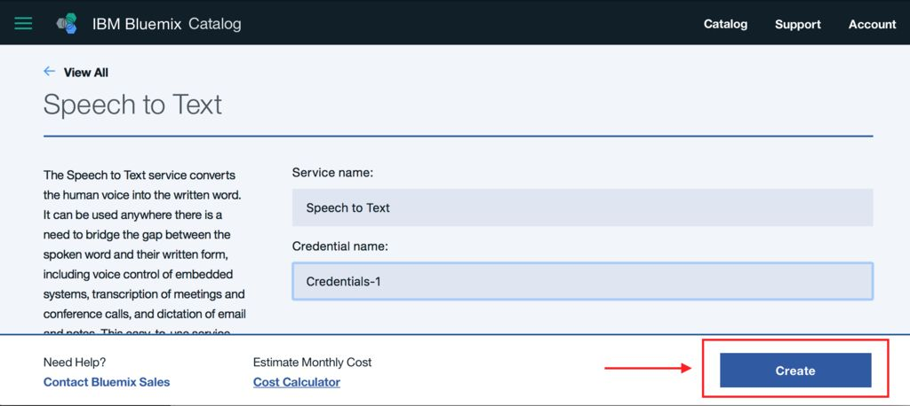
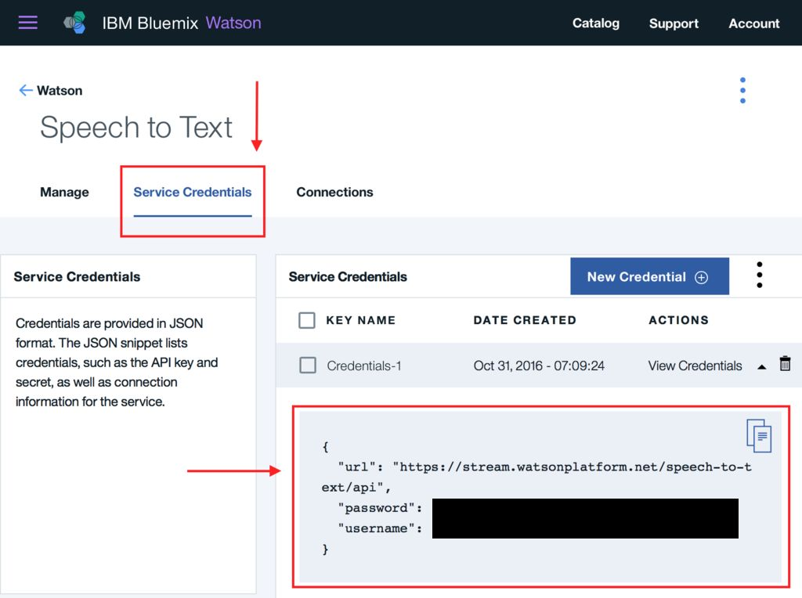
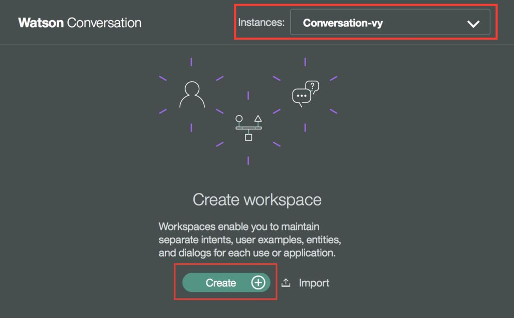
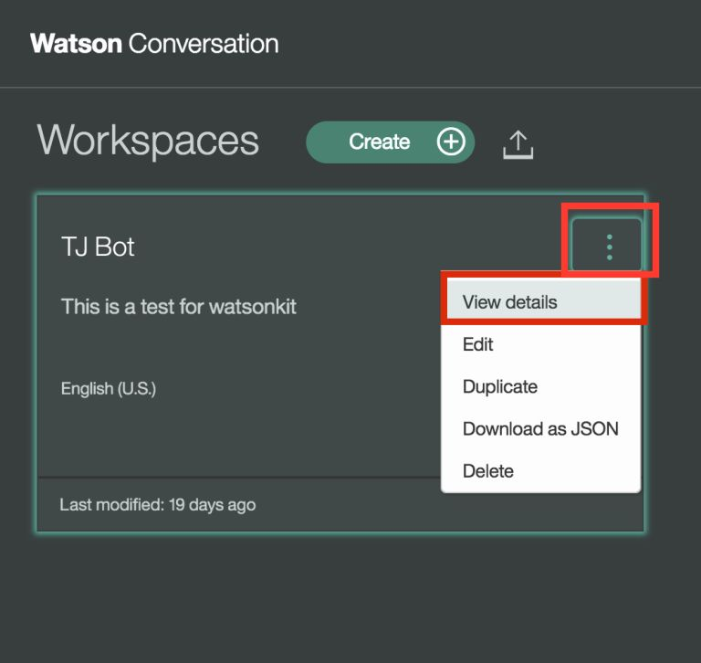
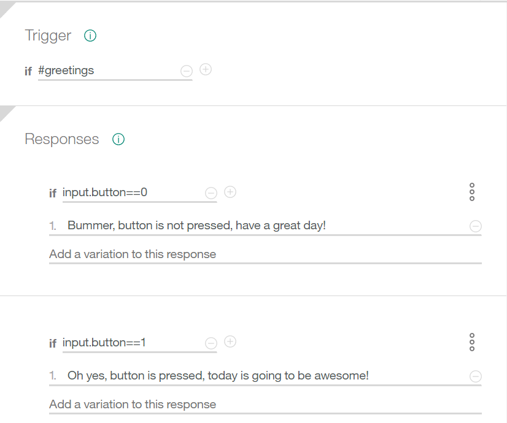
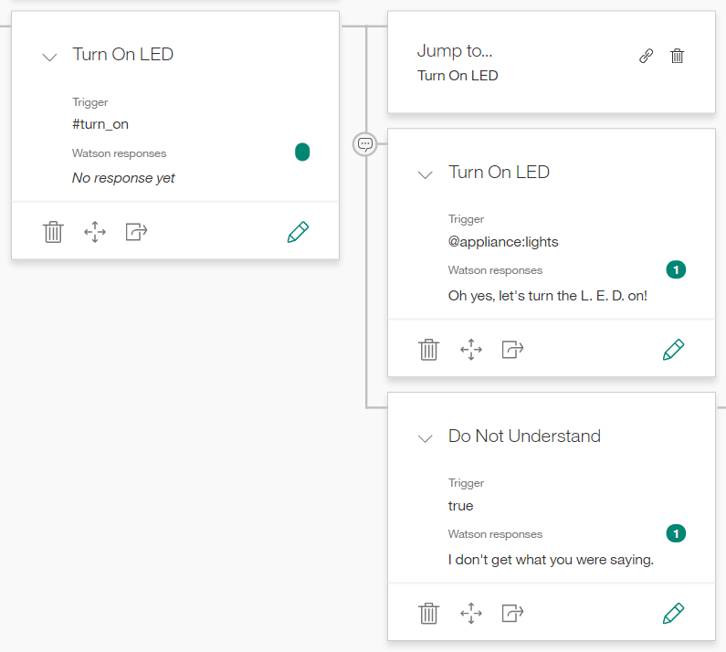
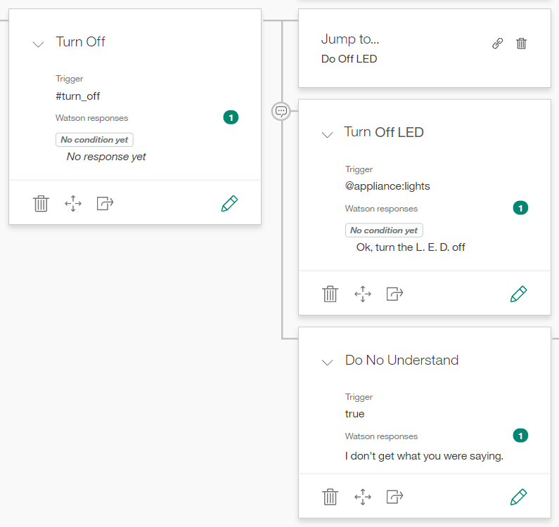
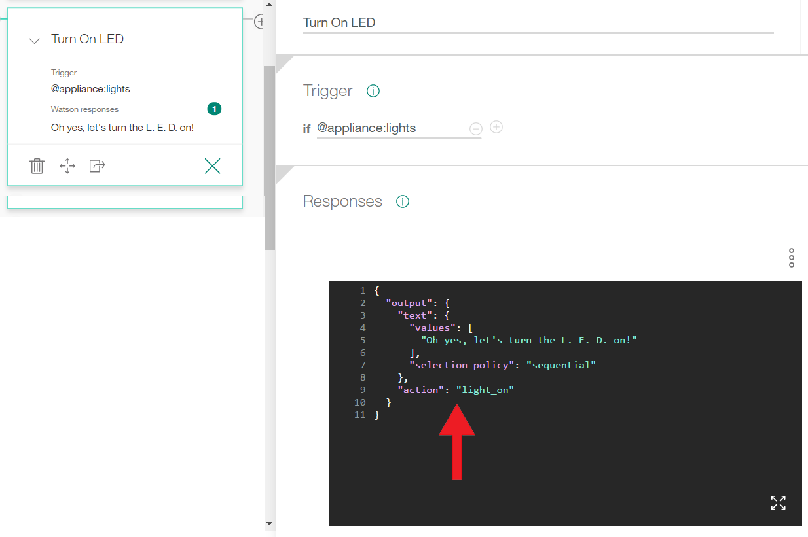

# WATSON PI PRIMER
Prepared by professor Kyle Li at Parson School of Design for Smart Craft Studio 2017. 

# Topic 1: Set up Waton Conversation service
## Step 1: Setup accounts
### IBM Academic account and IBM Bluemix trial account are two different accounts.
Sign up an IBM Academic Initiative account with your .edu e-mail (.edu e-mail gives you the quickest student/faculty/staff validation):

IBM Bluemix Promo Code - 12 Month Trial (Faculty/Staff): [click here](https://ibm.onthehub.com/WebStore/OfferingDetails.aspx?o=b46379bb-0463-e611-9420-b8ca3a5db7a1)

IBM Bluemix Promo Code - 6 Month Trial (Students): [click here](https://ibm.onthehub.com/WebStore/OfferingDetails.aspx?o=bb3528b7-2b63-e611-9420-b8ca3a5db7a1)

Now enable your IBM Bluemix trial account (Don’t forget, to complete the registration process you must respond to the click/accept text or email from id@bluemix.net). [click here](https://console.ng.bluemix.net/registration/?&ca=IBMEcoDWW-_-AI-_-Website-_-CloudOffer)

Login to your Bluemix dashboard. Click on ‘Account’ in the upper right corner and then on ‘Account Type’ in the left navigation. 
Enter the promo code from checkout. Click on ‘Apply’. IT’S RAGE FREE NOW!

## Step 2: Create Watson Services
You will use 3 types of Watson services in today’s workshop: (1) [Watson Speech to Text](https://www.ibm.com/watson/developercloud/speech-to-text.html), (2) [Watson Text to Speech](https://www.ibm.com/watson/developercloud/text-to-speech.html), and (3) [Watson Conversation](https://www.ibm.com/watson/developercloud/conversation.html). Let's start with the Watson Speech to Text service:
You can leave the default values and select 'Create'.



## Step 3: Copy the credentials
On the same page, go to 'Service Credentials' on the top-left menu and copy your credentials into clipboard.



Open terminal in RPI, navigate (cd) to the conversation recipe folder, and open config.js in the nano text editor.
```js
  cd tjbot/recipes/conversation/
  sudo nano config.js
```
Replace `exports.ConPassword`, `exports.ConUsername` and `exports.ConWorkspace` in `config.js` with followings
```
  // Credentials for Watson Speech to Text service
  exports.ConPassword = '************' ;
  exports.ConUsername = '********-****-****-****-************' ;
```
Repeat Step 2 and Step 3 untill you finish all three services. 
## Step 4: set up Workspace ID
IBM Conversation Service requires 1 more piece information - workspace ID. Log into https://www.ibmwatsonconversation.com with your IBM Bluemix trial account. From the top right corner, select the name of your conversation service and click 'create' to create a new workspace for your AI. 



Enter a name for your new workspace ID, once it is up, click on the three vertical dots and select 'view details' to see your workspace ID. Every workspace has an unique workspace ID. 




Inside `config.js`, Replace `exports.ConWorkspace` with the workspace ID above:
```
  ...
  exports.ConWorkspace = '********-****-****-****-************';
```
### Watson Conversation Dialog Special Conditions:
`welcome`: This condition is evaluated as true during the first dialog turn (when the conversation starts), only if the initial request from the application does not contain any user input. It is evaluated as false in all subsequent dialog turns. Typically, a node with this condition is used to greet the user, for example, to display a message such as "Welcome to our Pizza ordering app."

`conversation_start`: Like welcome, this condition is evaluated as true during the first dialog turn, but unlike welcome, it is true whether or not the initial request from the application contains user input. You can use a node with the welcome condition, a node with the conversation_start condition, or both, depending on the design of your application. A node with the conversation_start condition can be used to initialize context variables or perform other tasks at the beginning of the dialog.
anything_else: You can use this condition at the end of a dialog, to be processed when the user input does not match any other dialog nodes.

`irrelevant`: This condition will evaluate to true if the user’s input is determined to be irrelevant by the Conversation service.

`true`: This condition is always evaluated to true. You can use it at the end of a list of nodes or responses to catch any responses that did not match any of the previous conditions.

`false`: This condition is always evaluated to false. You might use this at the top of a branch that is under development, to prevent it from being used, or as the condition for a node that provides a common function and is used only as the target of a Jump to action.

# Topic 2: 

# Topic 3: Send and Receive Custom Value(s) 
In Topic 3, we are going to look at how to send and recieve custom values in real-time to/from the Watson Conversation Editor. Let's start with sending a custom value to the Watsons Conversation Editor. 

## Step 1: Hack `conversation.js` (again!)
Open terminal in RPI, navigate (cd) to the conversation recipe folder, and open `conversation.js` in the nano text editor.
```js
  cd tjbot/recipes/conversation/
  sudo nano conversation.js
```
## Step 2: Modify our button's callback function
We will be using the same setup as in Topic 2/Step 1. However, we will need the current state of the button in another place in the program. Add 1 extra line into button's callback code block to assign the current state of the button (0 or 1) to a global variable. We will also remove `led.digitalWrite(level);` from the callback function and save LED for a different purpose later. The new callback function will look like this: 
```js
  button.on('interrupt', function (level) {
  currentState = level;
  console.log("Button state: " + currentState);
  });
```
## Step 3: Send the global variable to the Conversation Editor
find step 4 in the `conversation.js`, it looks like this:
```js
/*********************************************************************
* Step #4: Parsing the Text and create a response
*********************************************************************
```
And find the first if statement after, it looks partially like this:
```js
  if (str.toLowerCase().indexOf(attentionWord.toLowerCase()) >= 0) {
    var res = str.toLowerCase().replace(attentionWord.toLowerCase(), "");
    console.log("msg sent to conversation:" ,res);
    conversation.message({
      workspace_id: config.ConWorkspace,
      input: {'text': res},
      context: context
    },  function(err, response) {
    ...
```
In this if statement, it sends the speech to text result to the conversation editor in a JSON array - `input: {'text': res}`. We are going to add our custom variable(s) in this array, the hitchhiker style! It looks like this: 
```js
  input: {'text': res, 'button':currentState},
```
I made up a variable name `button` and then assign the value of `currentState` to it. 
## Step 4: Configure the Watson Conversation Editor
It's pretty straight-forward from here on. Once our custom variable(s) arrives at Conversation Editor, it will be recognized as one of `input`'s properties and we can simply refer to it using `input.button`. Make sure the variable names are consistant.



In this Dialog node, I use the value of `input.button` as response conditions. When the button is pressed (1) at the moment of conversation, user will get a different response than when it's not pressed (0).
## Step 5: Setting the Watson Conversation Editor up for sending custom value(s)
While we are at the Watson Conversation Editor, let's add a few more Dialog nodes. We will be using a pre-populate intents and entities for this whorkshop. We will be creating two dialog nodes for us to turn on or off the LED. 

### Turn On LED


### Turn Off LED


## Step 6: Add our custom value in the Watson Converation Editor
When Watson Conversation decided on a response, it will send back the response text in a JSON file. We are going to insert our custom value `"action" = "light_on"` into Turn On LED dialog node's JSON file and `"action" = "light_off"` into Turn Off LED dialog node's JSON file. I made up the name `"action"` and its value according to the situation (based on Kobayashi sensei's early experiment), they have to be consistant on both the editor side and the Raspberry Pi (`conversation.js`) side.

### Turn On LED


### Turn Off LED


